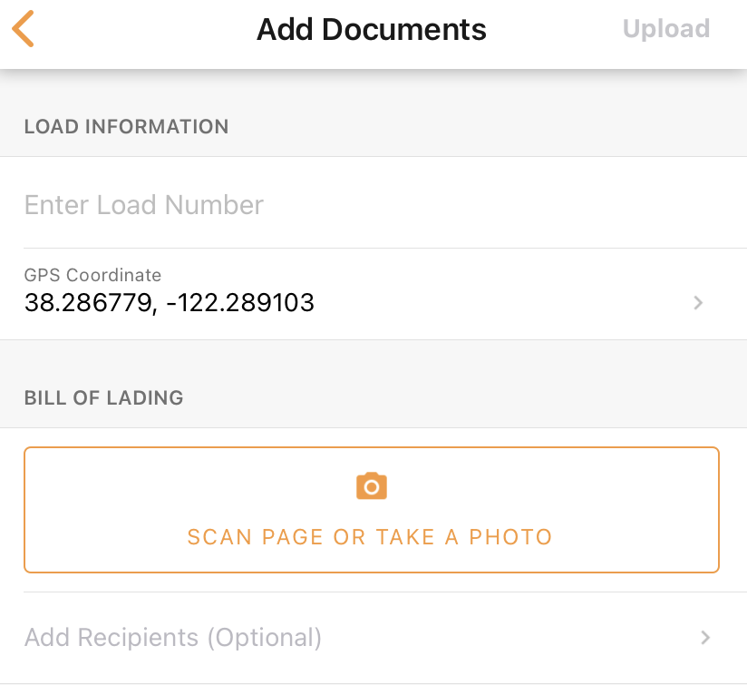
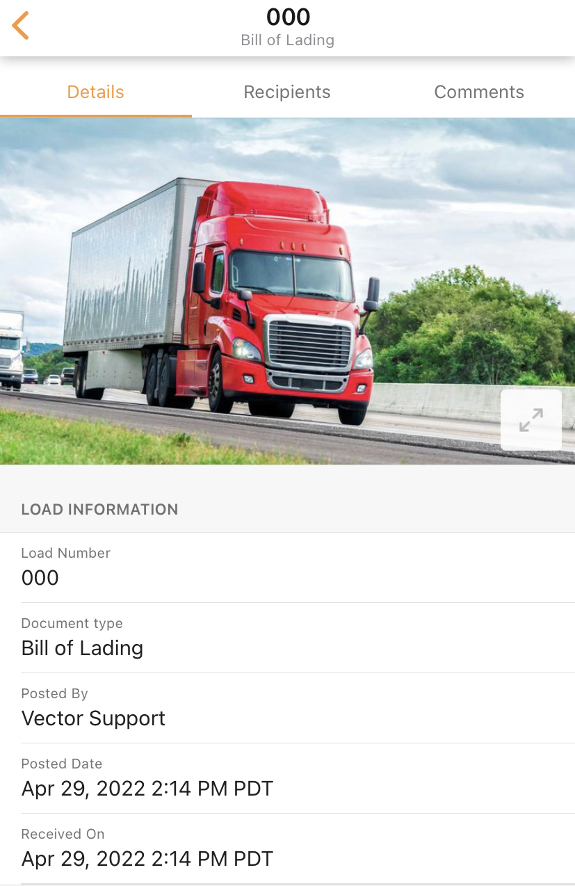
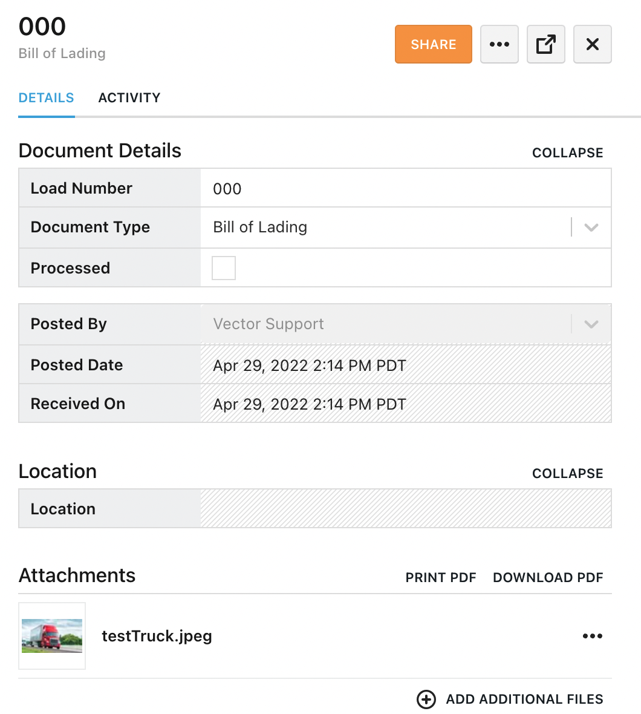
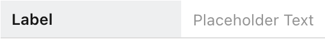

# Documents

## Properties

```json
"properties": {
  "custom_FIRMNAME_documents_DOCTYPE": {
    "properties" : {}, // custom_FIRMNAME_documents_DOCTYPE.propertyName
    "type": "object"
  },
  "document": {
    "properties": {}, // document.attachments, document.name
    "required": [ "propertyName" ],
    "type": "object"
  }
}
```

### Document Properties
- Inherited from `"$ref": "/1.0/entities/metadata/document.json"`
  - Also includes `recipients` and `location` properties (not shown in JSON)

```json
"document": {
  "properties": {
    "attachments": { // document.attachments
      "properties": {
        "files": { // attachments.files
          "minItems": 1, // must have 1 file minimum
          "type": "array"
        }
      },
      "required": [ "files"], // files must be included
      "type": "object"
    },
    "name": { // Load # - default label
      "isFilterable": true, // allows to be filtered
      "keyboardType": "numeric",
      "label": "", // used to overwrite Load # label
      "pattern": "", // custom RegExpt (OPTIONAL) to enforce input validation on format
      "type": "string"
    }
  },
  "required": [ "attachments" ], // attachments must be included
  "type": "object"
}
```

### Custom Properties

```json
"custom_FIRMNAME_documents_DOCTYPE": { // Custom Properties for Custom Doc
  "properties" : {
    "customProperty": {
      "type": "array/boolean/intger/null/number/object/string", // REQUIRED
    }
  },
  "type": "object"
}
```

| Property       | Options                                          | Notes                | Required? |
| :------------- | :----------------------------------------------- | -------------------- | :-------: |
| `type`         | `array/boolean/intger/null/number/object/string` | Datatype of property | Yes       |
| `label`        | `""`                                             | Name of property     | No        |
| `isFilterable` | `true/false`                                     | Allows for filtering | No        |
| `isSortable`   | `true/false`                                     | Allows for sorting   | No        |


---

## UI Schema

```json
"uiSchema": {
  "mobile": {
    "entityCreationSection": {},
    "entityDetailSection": {}
  },
  "web": {
    "entityDetailCardBodyPreview": {},
    "entityDetailCardBodyFullScreen": {},
    "entityCreationSection": {},
    "entityDetailSection": {}
  }
}
```

### Mobile

#### Entity Create Section

```json
"entityCreationSection": {
  "children": [
    {
      "children": [ // Also includes Load # and Location
        { // Attachments
          "errorPath": "document.attachments",
          "type": "ui:fileInput",
          "value": "document.attachments.files"
        },
        { // Recipients
          "mapActionsToProps": {
            "onChange": "handleRecipientsChange"
          },
          "mapStateToProps": {
            "value": "recipients"
          },
          "type": "ui:recipientsField"
        }
      ],
      "type": "ui:section" // Default name is name of the document
    },
    {
      "children": [ // Add custom properties/components here
        {
          "type":"ui:", // type of component
          "value":"" // Property this maps to (custom_doc.customProp)
        }
      ],
      "title": "", // Custom Section Title
      "type": "ui:section" // Custom Section
    }
  ],
  "mapStateToProps": {
    "title": "entityType"
  },
  "metadata": {
    "enableAutoGrayscale": true,
    "enablePageDetection": true,
    "identifiers": [
      {
        "path": "document.name"
      }
    ]
  },
  "type": "ui:view"
},
```




#### Entity Detail Section

```json
"entityDetailSection": {
  "children": [
    { // Attachment(s) displayed at top
      "type": "ui:attachmentViewer",
      "value": "document.attachments"
    },
    { // Section #1
      "children": [
        { // Load #
          "type": "ui:inputField",
          "value": "document.name"
        },
        { // Doc Name / Type
          "label": "Document type",
          "mapStateToProps": {
            "value": "entityType"
          },
          "type": "ui:inputField"
        },
        { // Posted By (User)
          "label": "Posted By",
          "mapStateToProps": {
            "value": "createdBy.displayName"
          },
          "type": "ui:inputField"
        },
        { // Posted Date (Creation Date)
          "type": "ui:inputField",
          "value": "creationDate"
        },
        { // Received on (Date Uploaded)
          "type": "ui:inputField",
          "value": "document.uploadDate"
        },
        { // Location
          "label": "Location",
          "type": "ui:addressField",
          "value": "document.address"
        },
        { // GPS
          "label": "GPS",
          "type": "ui:locationField",
          "value": "document.address"
        }
      ],
      "title": "Load Information", // Section Title
      "type": "ui:section"
    }
  ],
  "type": "ui:view"
}
```



### Web

#### Entity Create Section

```json
"entityCreationSection": {
  "children": [
    {
      "type": "ui:formTable",
      "children": [ // Add Properties here
        { // Load Number
          "placeholder": "Load Number",
          "type": "ui:inputField",
          "value": "document.name"
        },
        { // Recipients
          "mapActionsToProps": {
            "onChange": "handleRecipientsChange"
          },
          "mapStateToProps": {
            "value": "recipients"
          },
          "type": "ui:recipientsField"
        },
        { // Attachments
          "inputClassName": "ph2",
          "isHorizontalLayout": true,
          "isMultiFile": true,
          "label": "Attachments",
          "type": "ui:fileField",
          "value": "document.attachments.files",
          "valuePath": "document.attachments.files"
        },
        { // Location
          "isDisabled": true,
          "label": "Location",
          "type": "ui:geolocationField",
          "value": "document.address.geolocation"
        },
        { // Custom Property
          label : customPropertyName,
          type : ui:XYZ,
          value: custom_FIRMNAM_documents_DOCTYPE.customPropertyName
        }
      ]
    }
  ],
  "className": "mv3 grid-content",
  "type": "ui:view"
},
```


#### Entity Detail Section

```json
"entityDetailSection": {
  "children": [
    { // Section #1
      "children": [
        {
          "type": "ui:formTable",
          "className": "u-bumperBottom",
          "children": [
            { // Load #
              "type": "ui:inputField",
              "value": "document.name"
            },
            { // Doc Type (BOL/Custom Doc Type)
              "label": "Document Type",
              "type": "ui:documentTypeSelectField",
              "value": "mixins"
            },
            { // Processed
              "type": "ui:checkboxField",
              "value": "document.processed"
            }
          ]
        },
        { // Still in Section #1 but has a line break between above
          "type": "ui:formTable",
          "children": [
            { // Posted By (User)
              "isDisabled": true,
              "showLinkIcon": false,
              "type": "ui:entitySelectField", // Disabled by default
              "value": "createdBy"
            },
            { // Posted Date (Creation Date)
              "isDisabled": true,
              "type": "ui:inputField", // Disabled by default
              "value": "creationDate"
            },
            { // Received on (Date Uploaded)
              "isDisabled": true,
              "type": "ui:inputField", // Disabled by default
              "value": "document.uploadDate"
            }
          ]
        }
      ],
      "isCollapsable": true,
      "title": "Document Details", // Section Title
      "type": "ui:section"
    },
    { // Section #2
      "children": [
        {
          "type": "ui:formTable",
          "children": [
            { // Location
              "isDisabled": true,
              "showEditableFields": false,
              "label": "Location",
              "type": "ui:addressField",
              "value": "document.address"
            },
            { // GPS
              "isDisabled": true, // Hidden by default
              "label": "GPS",
              "type": "ui:locationField",
              "value": "document.address.geolocation"
            }
          ]
        }
      ],
      "isCollapsable": true,
      "title": "Location", // Section Title
      "type": "ui:section"
    },
    { // Section #3
      "children": [ // Components
        { // Attachments
          "type": "ui:filesViewer",
          "isHorizontalLayout": false,
          "value": "document.attachments"
        }
      ],
      "title": "Attachments", // Section Title
      "hideHeaderBorder": false,
      "type": "ui:section"
    }
    // Add new Sections Here
    {
      "children":[], // Add custom components here
      "type": "ui:section"
    }
  ],
  "type": "ui:view"
}
```



---

### UI Components

<table>
<tr>
<td> <strong>Component</strong> </td> <td> <strong>Code Snippet</strong> </td>  <td> <strong>Rendering</strong> </td> <td> <strong>Notes / Additional Properties</strong> </td>
</tr>

<tr>
  <td> <strong>Help Block</strong> </td>
  <td>

  ```json
  {
    "type": "ui:helpBlock", 
    "helptext": "This is what the..."
  }
  ```

  </td>
  <td>
    
  </td>
  <td></td>
</tr>

<tr>
  <td> <strong>Input Field</strong> </td>
  <td>

  ```json
  {
    "type": "ui:inputField"
  }
  ```

  </td>
  <td>
    
  </td>
  <td>

  ```json
  {
    "value": "customDocName.propertyThisMapsTo", // REQUIRED
    "label": "", // What shows on lefthand side
    "placeholder": "", // What shows on righthand side
    "isDisabled": true/false, // allows for editing
    "autoCorrect": true/false, // MOBILE ONLY
    "autoFocus": true/false // ENTITY CREATION ONLY
  }
  ```

  </td>
</tr>

<tr>
  <td> <strong>Input Field (Multi-Row)</strong> </td>
  <td>

  ```json
  {
    // WEB
    "type": "ui:textareaField",
    // MOBILE
    "type": "ui:inputField",
    "multiline": true
  }
  ```

  </td>
  <td>
    
  </td>
  <td>

  ```json
  {
    "value": "customDocName.propertyThisMapsTo" // REQUIRED
  }
  ```

  </td>
</tr>

<tr>
  <td> <strong>Section</strong> </td>
  <td>

  ```json
  {
    "type": "ui:section"
  }
  ```

  </td>
  <td>

  </td>
  <td>
  
  ```json
  {
    "title":"" // Section Title
  }
  ```

  </td>
</tr>

</table>
